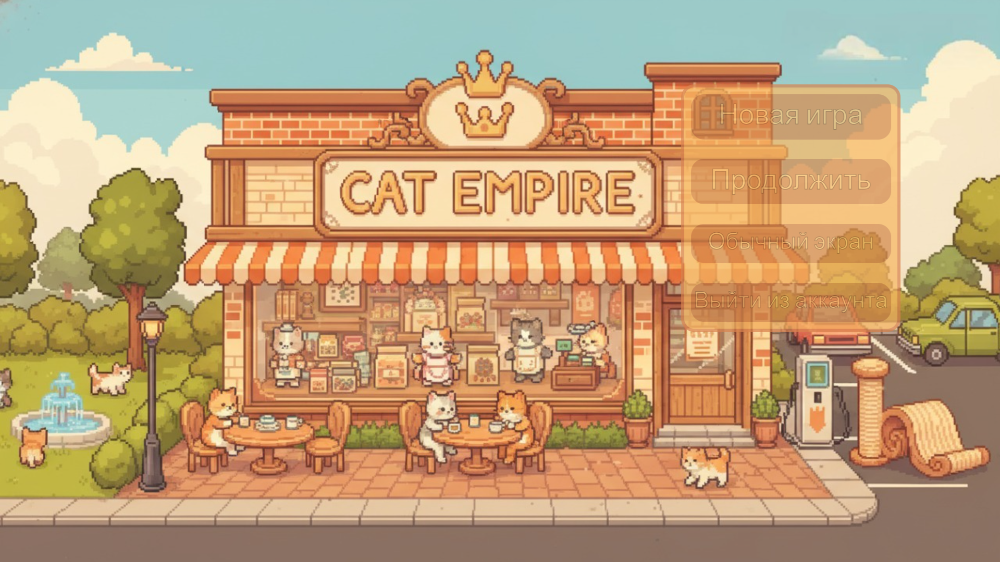
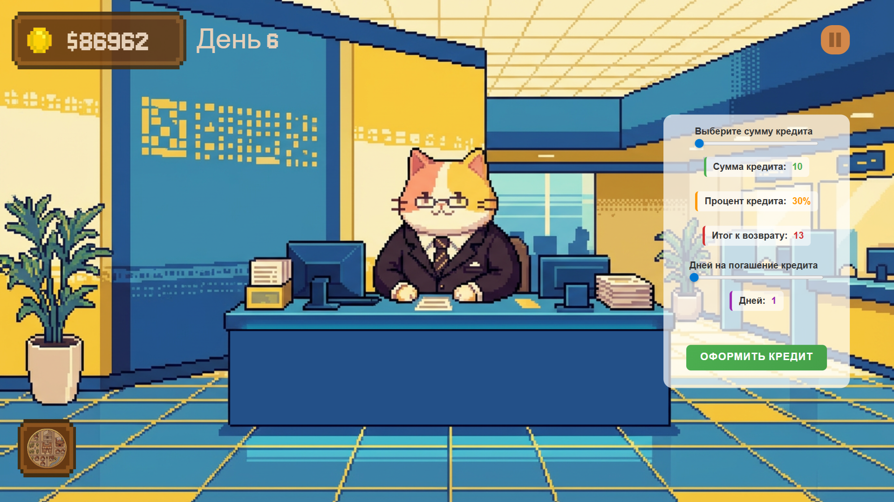

## CAT EMPIRE – экономическая игра на Django

Этот репозиторий содержит учебный/игровой проект на Django: симуляция магазина с банковской системой, казино, кредитами, покупателями и т.п.

В документации ниже предполагается, что вы скачали репозиторий себе на компьютер и хотите запустить проект локально.

### Скриншоты

**Главное меню / экран сохранений**  



**Банк и кредиты**  



**Казино**  


**Прогрессия развития магазина**  


---

## 1. Требования

- **Python** 3.10+ (рекомендуется актуальная 3.x)
- **Git** (для удобного клонирования репозитория)
- **pip** (обычно ставится вместе с Python)

Проверьте наличие Python:

```bash
python --version
```

или, в некоторых системах:

```bash
python3 --version
```

---

## 2. Клонирование репозитория

Откройте терминал/PowerShell и выполните:

```bash
git clone <URL_репозитория>
cd GroupProject
```

Если у вас нет git, можно скачать ZIP-архив с GitHub и распаковать его, затем в терминале перейти в папку проекта.

---

## 3. Создание и активация виртуального окружения

### Windows (PowerShell / cmd)

```bash
python -m venv venv
venv\Scripts\activate
```

### Linux / macOS

```bash
python3 -m venv venv
source venv/bin/activate
```

После активации в начале строки терминала вы увидите префикс вида `(venv)`.

Чтобы выйти из окружения:

```bash
deactivate
```

---

## 4. Установка зависимостей

Убедитесь, что находитесь в корне проекта (там, где лежит `requirements.txt`), и выполните:

```bash
pip install -r requirements.txt
```

Если у вас Python вызывается как `python3`, то иногда полезно явно использовать:

```bash
python -m pip install -r requirements.txt
```

---

## 5. Подготовка базы данных

Перейдите в директорию с Django-проектом и выполните миграции.

Из корня репозитория:

```bash
cd project
python manage.py migrate
```

(при необходимости используйте `python3` вместо `python`).

При первом запуске это создаст все необходимые таблицы в SQLite-базе.

При желании вы можете создать суперпользователя для доступа к админке Django:

```bash
python manage.py createsuperuser
```

---

## 6. Запуск сервера разработки

Находясь в папке `project`, запустите:

```bash
python manage.py runserver
```

По умолчанию сервер будет доступен по адресу:

- `http://127.0.0.1:8000/` или
- `http://localhost:8000/`

Откройте этот адрес в браузере, чтобы увидеть главное меню игры.

Если порт 8000 уже занят, Django предложит другой порт или вы можете указать его сами:

```bash
python manage.py runserver 0.0.0.0:8001
```

---

## 7. Структура проекта (кратко)

- `project/game/` – основное Django-приложение:
  - `views.py` – логика игры, банк, казино, кредиты, конец дня и т.п.
  - `templates/` – HTML-шаблоны (главное меню, геймплей, банк, казино и т.д.)
  - `static/js/` – клиентская логика (управление временем, покупатели, кредиты, казино)
- `media/`:
  - `media/docum_imgs/` – скриншоты для документации
  - `media/sfx/` – звуковые эффекты

---

## 8. Типичный сценарий использования

1. Зарегистрировать аккаунт на стартовом экране.
2. Создать сохранение и начать новую игру.
3. Управлять магазином: выставлять цены, обслуживать покупателей через планшет.
4. При необходимости брать и погашать кредиты в банке.
5. При желании сыграть в казино.
6. В конце дня завершать день и анализировать статистику.

---

## 9. Полезные советы

- **Не запускайте сервер Django без виртуального окружения**, чтобы не засорять глобальные пакеты.
- При изменении кода **перезапускать сервер не нужно** – Django перезагружает его автоматически, но при изменении настроек/зависимостей лучше перезапустить.
- Если что-то «сломалось», проверьте:
  - активацию виртуального окружения,
  - что все зависимости установлены,
  - логи в терминале, где запущен `runserver`.

---

## 10. Обновление проекта

Если вы уже клонировали репозиторий и хотите получить последние изменения:

```bash
git pull
```

После обновления **рекомендуется**:

```bash
pip install -r requirements.txt
cd project
python manage.py migrate
```

---

Проект предназначен для локального запуска в режиме разработки. Для деплоя в продакшн потребуются дополнительные шаги (настройка БД, сервера, статики и т.д.), которые в этой документации не описаны.